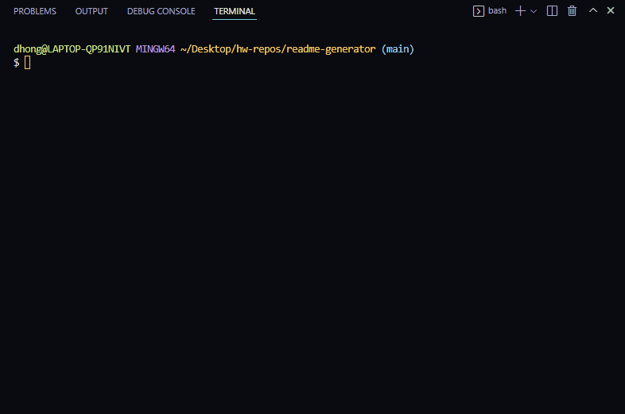
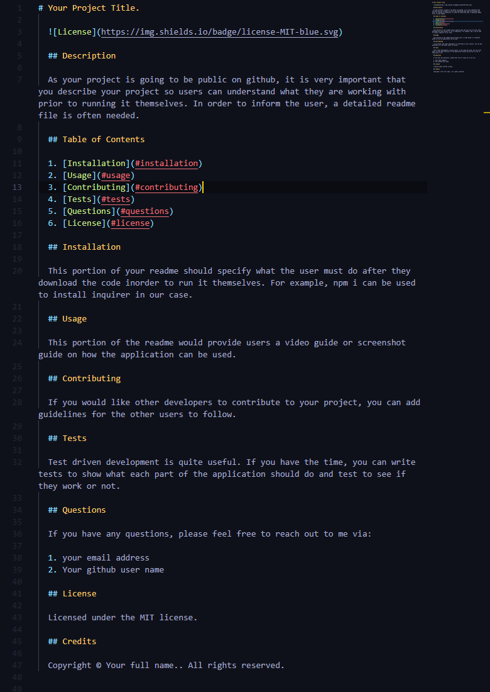

# README Generator


## Description

How great would if be if we only had to type out the content of our readme and a program automatically creates and structures a readme file with all of your content? The following readme generator application does just that.

The purpose in creating this application was to quickly generate a professional readme for my fellow programmers who dont want to spend that extra time formatting a readme. This readme was in fact generated by the same application being mentioned in the project.

[Click Here](https://youtu.be/7SG4Tf46ITU) to see the video guide! There is also a gif in the [Usage](#usage) section below.

## Table of Contents

1. [Installation](#installation)
2. [Usage](#usage)
3. [Tests](#tests)
4. [Questions](#questions)
5. [License](#license)

## Installation

In order to install this application and use it, you would need to install inquirer.

To do so, you would have to run the following after you clone the files down.

```
npm i

```

This will install inquirer and you will be well on your way to generating a professional readme.

## Usage

In order to run the application, you would need to run the following in your terminal.

```
node index

```

You will then be prompted with several questions to help you generate your professional readme.

### Please see the gif and screenshot below!



### Here is the final product of that demonstration!



## Tests

I have not written any tests for this application. However, if I am able to, I will have them pushed and have instructions on how to use.

## Questions

If you have any questions, please feel free to reach out to me via:

1. Email: dhong0925@gmail.com
2. GitHub: Lunirs

## License

Licensed under the MIT license.

## Credits

Copyright © Daniel Hong All rights reserved.
